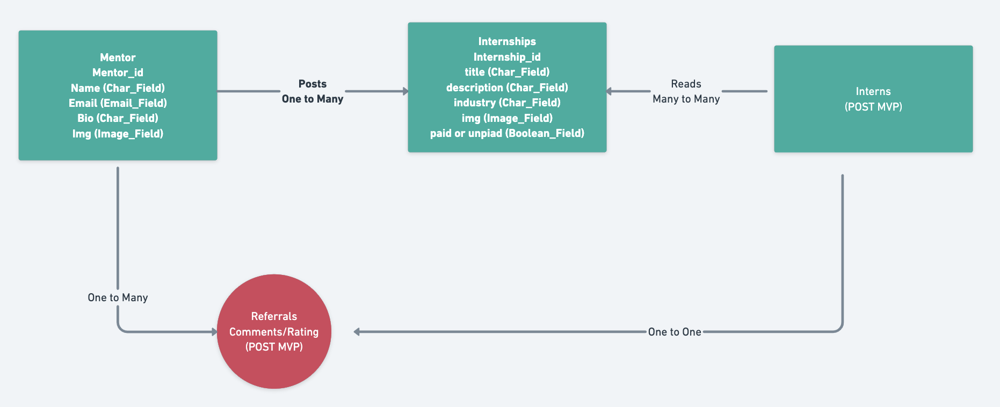

# 12-pell-internship

The 12Pell Intern and Mentorship app is a platform for youth interns in the local community to find mentors through our network. 

## Mentors

Mentors signup for the site on the site with a bio talking about their career and what they have to offer. They are able to post multiple listings describing their proposed internship program. Members associated with the commnity are able to give the mentors recommendations, ratings, and upvotes to validate their credentials.

## Interns

Youth interns will eventually be able to apply for access to the site with a resume, and bio. 

## Technology

The backend is built using Django with a postgres database, deployed on heroku. The frontend is built with react and deployed on netlify.

## Entity Relationship Diagram

  

## Wireframe

  

## Component Hierarchy

  

## MVP / post MVP

### Mvp
- Mentors are able to post their bios
- Mentors can log in and create, edit, delete listings

### post MVP
- Referrals can be posted about mentors
- Potential interns can sign up and post resumes and bio
- Replay to comments
- Interns can apply through the app
- Send private msg via inbox

## Project Schedule

|  Day | Deliverable | Status
|---|---| ---|
|JAN 24| Prompt / Wireframes / Priority Matrix / Timeframes | Incomplete
|JAN 25| Build Django backend and deploy API  | Incomplete
|JAN 26| Build react components and structure / Have CRUD working  | Incomplete
|JAN 27| Pseudocode / actual code utilities and other components| Incomplete
|JAN 28 - 30| Styling and CSS | Incomplete
|JAN 31| Presentations | Incomplete
